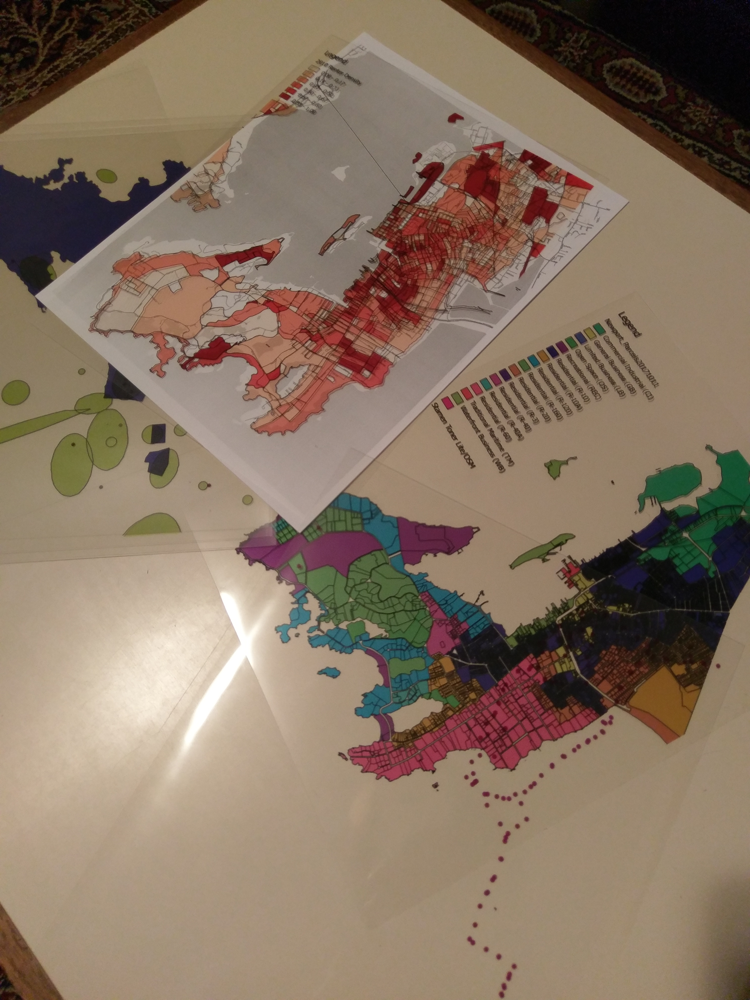

# GIS Unplugged

The files in this repository are rendered geospatial datasets for Newport, RI, intended to be printed on transparencies and used for offline mapping activities.  

Datasets are from [RIGIS](http://www.rigis.org) and the [Newport Data Project](http://newportdataproject.org). The base map uses [Stamen Toner Lite](http://maps.stamen.com/toner-lite).  The maps are created using the [QGIS](https://qgis.org) print composer included in this repository, `newport-singlepage.qpt`.